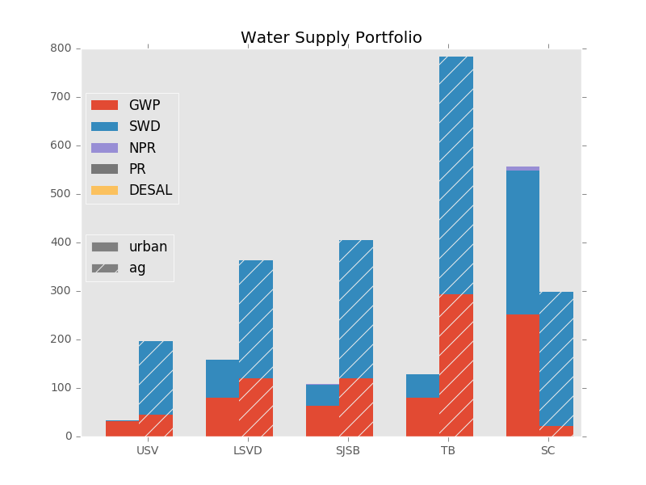

# CALVIN Shortcourse

This is a short course intended for those who are interested in large-scale water optimization modeling with CALVIN model. Some basic optimization knowledge, especially linear programming, is assumed. This crash course introduces basics of CALVIN model with Pyomo modeling environment. CALVIN is a large-scale hydroeconomic optimization model for California, aiming to optimize water allocation to users. CALVIN is the same model as CALVIN but modeled in a different environment employing different solvers. It is an integrated model with surface and groundwater representation, covering California's most water and water-related economic activities.

*********************************
# CALVIN website:
See CALVIN website for documentation and more information

https://CALVIN.ucdavis.edu

*********************************
# CALVIN online visualization tool:
Online CALVIN schematic and data visualization tool

https://cwn.cws.ucdavis.edu

*********************************
# Pre Workshop Reading:
Recordings from the Workshop

https://ucmerced.box.com/s/1bhs3f4myazj5g0j8wd00yb3nwjh5xwr

*********************************
# Workshop Agenda:
Agenda from the Workshop

*********************************
# Workshop Recordings from 2020 Workshop:
Recordings from the Workshop

https://ucmerced.box.com/s/ttta7lfh1pspuh7xl6yurn8ogmnjmkr5

*********************************
# How to install CALVIN:
Recordings from the Workshops and documentation

https://ucmerced.box.com/s/y7mciauhpod3e6lblawumxy22hngrnkm

# Related GitHub repositories:

## CALVIN main repository

This repository has CALVIN's model structure, including decision variables, objective function and constraints. There are also example runs and some brief documentation.

https://github.com/ucd-cws/calvin

## HOBBES database

HOBBES database hosting CALVIN network data. Database includes California's water infrastructure data (capacities, network properties etc) and hydrology data (inflow, groundwater etc.)

https://github.com/ucd-cws/calvin-network-data

## CALVIN network tools

CALVIN network tool is used to export water network matrix of California from HOBBES database in a format that CALVIN python version can read.

https://github.com/ucd-cws/calvin-network-tools

## Some postprocessed results

Change in California's overall surface water storage over the 82-year period:

Change in California's overall groundwater storage over the 82-year period:

Water deliveries to agricultural and urban users 
(USV: Upper Sacramento Valley; LSVD: Lower Sacramento Valley and Delta; SJSB: San Joaquin and South Bay; TB: Tulare Basin; SC: Southern California

